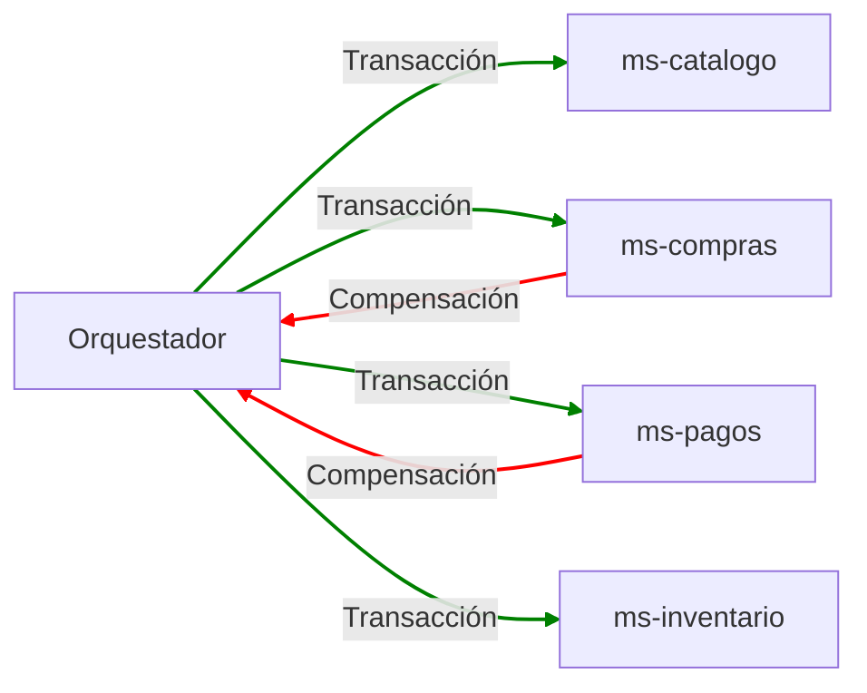

# 🏫 **Universidad Tecnológica Nacional**

## Facultad Regional San Rafael

## Ingeniería en Sistemas

## **Desarrollo de Software**

## **Patrón Saga – Trabajo Práctico**

---

# 📌 Contexto y problema

Una **transacción** representa una unidad de trabajo que puede incluir varias operaciones.  
Dentro de una transacción:

- Un **evento** es un cambio de estado que afecta a una entidad.
    
- Un **comando** encapsula toda la información necesaria para ejecutar una acción o desencadenar un evento posterior.
    

Las transacciones deben cumplir los principios **ACID**:  
**Atomicidad, Coherencia, Aislamiento y Durabilidad**.  
([https://es.wikipedia.org/wiki/ACID](https://es.wikipedia.org/wiki/ACID))

En una arquitectura de microservicios, garantizar ACID se vuelve complejo porque cada servicio maneja su propia base de datos. Para resolver esto se aplica el **Patrón Saga**.

---
# trabajo practico
# 🛒 Sistema propuesto

Se cuenta con un sistema de comercio electrónico compuesto por 4 microservicios:

- **ms-catálogo**: gestiona los productos y sus detalles.
    
- **ms-compras**: persiste las compras realizadas.
    
- **ms-pagos**: procesa los pagos.
    
- **ms-inventario**: controla el stock.
    

El objetivo es **resolver el problema ACID usando el Patrón Saga**, implementado mediante **orquestación**.

---

# 🔄 Flujo de una transacción

Según el documento:

1. Un usuario selecciona el producto.
    
2. Realiza el pago.
    
3. Se actualiza el inventario.
    
4. Se actualizan los productos comprados por el usuario.
    

Además:

- Se deben simular **latencias** y **errores aleatorios** entre microservicios.
    
- **ms-compras** y **ms-pagos** deben tener 2 endpoints:
    
    1. Transacción → devuelve **200** o **409** aleatoriamente.
        
    2. Compensación → devuelve siempre **200**.
        
- **ms-catálogo** siempre devuelve un producto con datos aleatorios (200).
    
- **ms-inventario** puede devolver:
    
    - **200** (inventario actualizado), o
        
    - **409** (sin stock) → dispara compensación en los demás microservicios.
        
- El cliente recibe un mensaje según el resultado final de la Saga.
    

---

# 📊 **Diagrama (convertido a Mermaid)**

Este diagrama está basado en el esquema del **page 2**, con flechas verdes (transacciones) y rojas (compensaciones).

---

# 🧪 Criterios de evaluación

Según el documento:

- **Funcionalidad**: ¿cumple los requerimientos?
    
- Código basado en principios:
    
    - **KISS**
        
    - **DRY**
        
    - **SOLID**
        
    - **Código Limpio**
        
- Este trabajo es obligatorio si algún integrante del grupo tiene nota entre **5.5 y 6.9**.
    

---